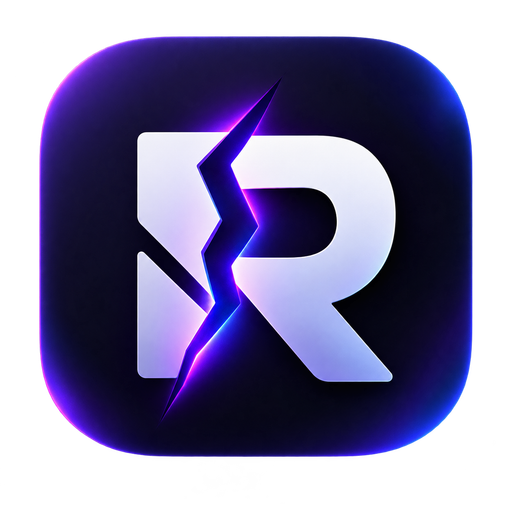

  

  # Rift

  **Voz, vídeo e compartilhamento de tela com captura de jogo** — inclusive jogos em tela cheia e com anti-cheat.

  ### [⬇️ Baixar o Rift (Windows)](https://github.com/gothardii/rift-releases/releases/latest)

---

## 📥 Instalação

1. Baixe o **[Rift-Setup-0.3.0.exe](https://github.com/gothardii/rift-releases/releases/latest/download/Rift-Setup-0.3.0.exe)** (instalador).
2. Ao abrir, o Windows mostra um aviso azul (o app ainda não é assinado) → clique em **"Mais informações" → "Executar assim mesmo"**.
3. Siga o instalador — ele cria atalho na área de trabalho e no menu iniciar.

> **Prefere não instalar?** Baixe o **`.zip` portátil** na [página de releases](https://github.com/gothardii/rift-releases/releases/latest), extraia e rode `Rift.exe`.

## ✨ Recursos

- 🎮 **Captura de jogo** (tela cheia e anti-cheat), com detecção mesmo em segundo plano
- 🔊 **Áudio isolado** do jogo + supressor de ruído no microfone
- 📺 Transmissão em **1080p60**
- 💬 Voz, vídeo, chat e compartilhamento de tela por sala

## 💻 Requisitos

Windows 10/11 (64-bit).

## ⚠️ Dica para jogos em tela cheia

Se o jogo estiver em **tela cheia exclusiva**, mantenha-o visível enquanto joga (ou use 2 monitores) — a transmissão aparece enquanto o jogo está renderizando.
